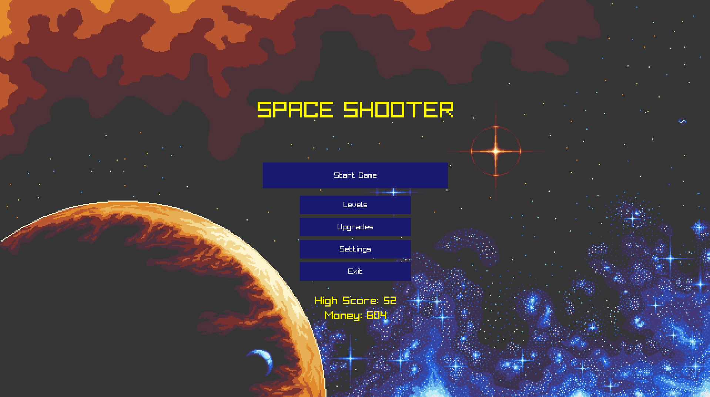
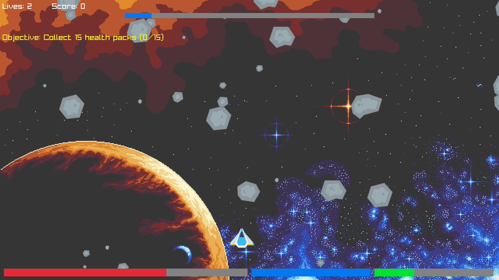

# Meteor Strike

Meteor Strike is an action-packed C++ game powered by [raylib](https://www.raylib.com/)! Defend Earth from a relentless meteor shower in this retro-inspired arcade experience.

---

## 🚀 Features

- Built with the powerful raylib game framework
- Fast-paced arcade gameplay
- Multiple weapon upgrades
- Increasing difficulty with each level

---

## 📦 Installation

### Prerequisites

- Sugested to build using .sln file  
- C++17 or newer
- [raylib](https://www.raylib.com/) (version 4.x recommended)

### Steps

1. **Clone the repository**
   ```bash
   git clone https://github.com/ASOM846/Meteor-Strike.git
   ```

2. **Install dependencies**
   - **On Windows:**  
     Download and install [raylib](https://www.raylib.com/).  
     Make sure raylib is in your PATH or project environment.

3. **Build the project**
    Build it using visual studio 2017 or newer.

4. **Run the game**
    By opening .exe file in your build folder or diectly from vs after builing.

---

## 🖼️ Screenshots

Screenshots from the current version (all captured with raylib):

<p align="center">
  
  
</p>

---

## ⚠️ Disclaimer

This project is provided "as is" without warranty of any kind.  
Meteor Strike is a personal project for learning and entertainment purposes only.  
All assets (graphics, music, etc.) are either original, open source, or used with permission. If you believe any asset violates your rights, please open an issue.

---

## 🙏 Credits

- Developed by [ASOM846](https://github.com/ASOM846)
- Powered by raylib

---

## 📬 Contributing

Pull requests are welcome! For major changes, please open an issue first to discuss your ideas.

---

## 📄 License

This project is licensed under the License. See [LICENSE](LICENSE.txt) for details.
